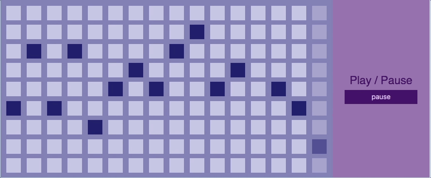

# Beat-Sequencer

### Background

  The Beat sequencer is an easy way for anyone to create their own beats. You simply choose a bpm, and click the keys to create your own sick beat.

### Technologies
  * Vanilla JavaScript for accessing and manipulating the DOM
  * Tone.js framework used for web audio implementation
  * CSS for design

